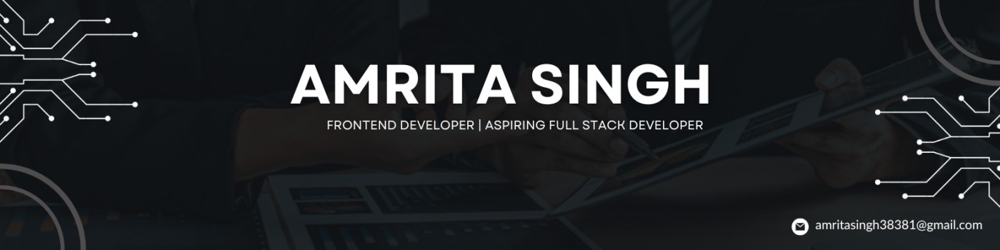

  

---

  

  <strong>🚀 Full Stack Developer | B.Tech IT Student | Founder @GraphEra</strong>

  
  
  
  

---

## 💻 WORKSPACE DASHBOARD

<table width="100%" border="0" cellpadding="0" cellspacing="0">
  <tr>
    <td width="45%" valign="top">
      <h3>👤 ABOUT ME</h3>
      <ul>
        <li>🎓 <b>B.Tech IT Student</b> at GGSIPU</li>
        <li>👩‍💻 <b>Full Stack Developer Intern</b> at Edubuk</li>
        <li>✨ <b>Founder & Creator</b> of GraphEra</li>
        <li>💡 Passionate about building <b>real-world solutions</b></li>
        <li>💜 Love to learn, explore and collaborate</li>
      </ul>
    </td>
    <td width="55%" valign="top">
      <table width="100%" border="0" cellspacing="8" cellpadding="12">
        <tr>
          <td align="center" bgcolor="#0d061f" style="border: 1px solid #391459; border-radius: 8px;">
            🚀 PROJECTS 
            <b>10+</b> 
            Completed
          </td>
          <td align="center" bgcolor="#0d061f" style="border: 1px solid #391459; border-radius: 8px;">
            🛠️ TECH STACK 
            <b>10+</b> 
            Technologies
          </td>
        </tr>
        <tr>
          <td align="center" bgcolor="#0d061f" style="border: 1px solid #391459; border-radius: 8px;">
            🐙 GITHUB 
            <b>70+</b> 
            Contributions
          </td>
          <td align="center" bgcolor="#0d061f" style="border: 1px solid #391459; border-radius: 8px;">
            🎯 GOAL 
            <b>SDE</b> 
            Role
          </td>
        </tr>
      </table>
    </td>
  </tr>
</table>

---

## 🛠️ TECH STACK

<table width="100%" border="0" cellpadding="8" cellspacing="5">
  <tr bgcolor="#0d061f" style="border: 1px solid #391459;">
    <td width="20%" align="center"><b>Frontend</b></td>
    <td></td>
  </tr>
  <tr bgcolor="#0d061f" style="border: 1px solid #391459;">
    <td width="20%" align="center"><b>Backend</b></td>
    <td></td>
  </tr>
  <tr bgcolor="#0d061f" style="border: 1px solid #391459;">
    <td width="20%" align="center"><b>Database</b></td>
    <td></td>
  </tr>
  <tr bgcolor="#0d061f" style="border: 1px solid #391459;">
    <td width="20%" align="center"><b>Tools & Platforms</b></td>
    <td></td>
  </tr>
  <tr bgcolor="#0d061f" style="border: 1px solid #391459;">
    <td width="20%" align="center"><b>Others</b></td>
    <td></td>
  </tr>
</table>

---

## ⭐ FEATURED PROJECTS

<table width="100%" border="0" cellspacing="10" cellpadding="10">
  <tr>
    <td width="33%" bgcolor="#0d061f" style="border: 1px solid #391459; border-radius: 8px;" valign="top">
      <h4>📈 Stock Screener</h4>
      
Real-time stock analysis platform with mixers, charts & indicators.

       
      <code>MERN Stack</code>
    </td>
    <td width="33%" bgcolor="#0d061f" style="border: 1px solid #391459; border-radius: 8px;" valign="top">
      <h4>🏢 Complaint Portal</h4>
      
Smart campus complaint system for students & faculty.

       
      <code>MERN Stack</code>
    </td>
    <td width="33%" bgcolor="#0d061f" style="border: 1px solid #391459; border-radius: 8px;" valign="top">
      <h4>🔮 GraphEra Website</h4>
      
Official website for my startup GraphEra.

       
      <code>React + Tailwind</code>
    </td>
  </tr>
  <tr>
    <td width="33%" bgcolor="#0d061f" style="border: 1px solid #391459; border-radius: 8px;" valign="top">
      <h4>💰 Finance Tracker</h4>
      
Personal finance tracker with analysis & insights.

       
      <code>MERN Stack</code>
    </td>
    <td width="33%" bgcolor="#0d061f" style="border: 1px solid #391459; border-radius: 8px;" valign="top">
      <h4>🤖 AI Resume Analyzer</h4>
      
AI powered resume analysis and improvement suggestions.

       
      <code>Python • NLP</code>
    </td>
    <td width="33%" bgcolor="#0d061f" style="border: 1px solid #391459; border-radius: 8px;" valign="top">
      <h4>💼 Portfolio Website</h4>
      
My personal portfolio to showcase my work & acts.

       
      <code>React + Tailwind</code>
    </td>
  </tr>
</table>

---

## 📊 GITHUB ANALYTICS (STATS, STREAKS & PIE CHARTS)

<table width="100%" border="0" cellspacing="5" cellpadding="0">
  <tr>
    <td width="50%" valign="top">
      
    </td>
    <td width="50%" valign="top">
      
    </td>
  </tr>
  <tr>
    <td colspan="2" width="100%" valign="top">
       
      
    </td>
  </tr>
</table>

---

## 🏆 ACHIEVEMENTS & ROADMAP FLOW

<table width="100%" border="0" cellspacing="0" cellpadding="0">
  <tr>
    <td width="45%" valign="top">
      <h3>🏅 HIGHLIGHTS</h3>
      <ul>
        <li>👑 <b>Founder of GraphEra</b> Building a design-focused creative tech brand.</li> 
        <li>👩‍💻 <b>Full Stack Developer Intern @ Edubuk</b> Working on real-world projects and improving skills.</li> 
        <li>🔥 <b>Active Contributor</b> Consistent GitHub contributions and project building.</li> 
        <li>🏆 <b>Hackathon Enthusiast</b> Participated in multiple hackathons and events.</li>
      </ul>
    </td>
    <td width="55%" valign="top">
      <h3>📈 DEVELOPMENT PIPELINE</h3>
      <pre>
┌─────────────────────────────────────────┐
│     Requirement Gathering & Logic       │
└────────────────────┬────────────────────┘
                     ▼
┌─────────────────────────────────────────┐
│     UI/UX Concept & Styling (Figma)     │
└────────────────────┬────────────────────┘
                     ▼
┌─────────────────────────────────────────┐
│   Frontend Engine (React / TypeScript)   │
└────────────────────┬────────────────────┘
                     ▼
┌─────────────────────────────────────────┐
│   Robust Backend API (Node.js / Express) │
└────────────────────┬────────────────────┘
                     ▼
┌─────────────────────────────────────────┐
│     Database Ecosystem & Security       │
└─────────────────────────────────────────┘
      </pre>
    </td>
  </tr>
</table>

---

## 🎯 CURRENT FOCUS

<table width="100%" border="0" cellspacing="5" cellpadding="10" align="center">
  <tr align="center">
    <td bgcolor="#0d061f" style="border: 1px solid #391459; border-radius: 8px;">
      ☕ <b>DSA in Java</b> Improving problem-solving skills
    </td>
    <td bgcolor="#0d061f" style="border: 1px solid #391459; border-radius: 8px;">
      ⚙️ <b>Backend Development</b> Building scalable & secure APIs
    </td>
    <td bgcolor="#0d061f" style="border: 1px solid #391459; border-radius: 8px;">
      🏗️ <b>System Design</b> Learning low-level & high-level design
    </td>
    <td bgcolor="#0d061f" style="border: 1px solid #391459; border-radius: 8px;">
      🌐 <b>Open Source</b> Contributing to open source projects
    </td>
    <td bgcolor="#0d061f" style="border: 1px solid #391459; border-radius: 8px;">
      🚀 <b>Product Building</b> Building real-world solutions
    </td>
  </tr>
</table>

---

## 🔗 CONNECT WITH ME

  
  
  

---

  <b>❝ Don't just learn technology. Build solutions that create impact. ❞</b>   💜

